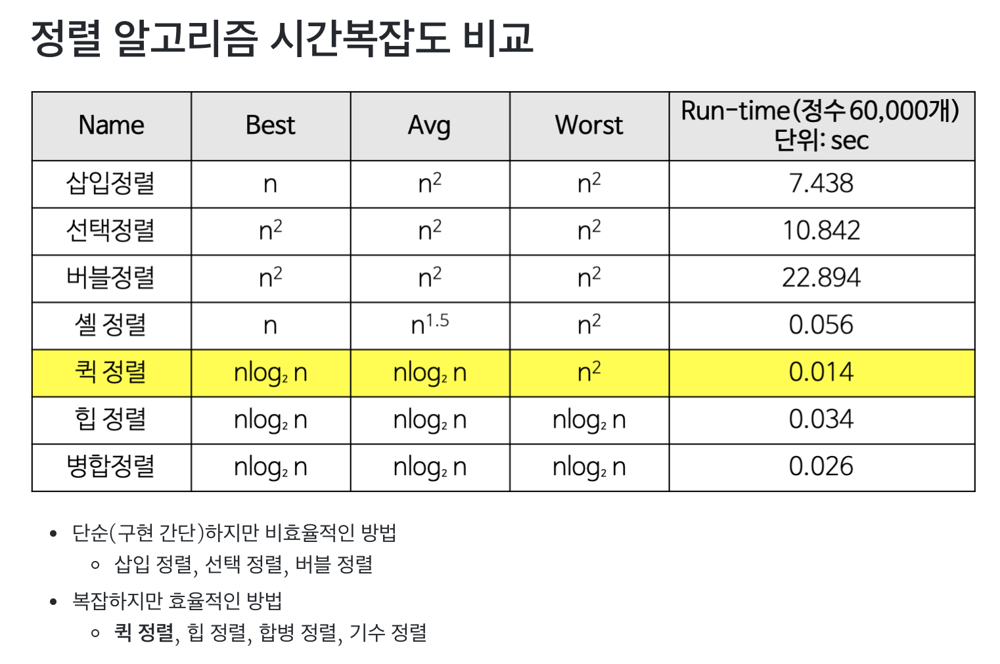

# 과제 분석

이번 과제에 주어진 조건 하에서 최적의 프로그램은 무엇일까

평균적으로 매우 빠른 알고리즘을 찾아서 구현하는것이 중요한게 아니라, 주어진 자료형에 적용가능한 적용 알고리즘들을 학습하여, 해당 알고리즘들이 유리한 상황과 불리한 상황에 대한 학습이 선행되어야 할 거 같다. 

두 개의 프로그램 만들어야 함

1. 체커 (ㅇ) - instructions 을 인자로 받아서 수행 후 정렬 여부를 판단하는 프로그램
2. push_swap - 최적의 instructions을 찾아내는 프로그램.

# 체커

1. 인자 검사
   - 인자는 모두 인티져여야함
   - 인자가 없으면 체커는 종료되고 아무것도 출력하지 않는다.

2. 명령 받기
   - stdin으로 명령을 받는다. 각 명령은 \n으로 끝, 모든 명령이 읽혔을 때, 체커는 인자로 받은 스택에 명령을 실행 한다.

3. 명령 수행 후

   - stack A가 정렬 되어있고, b 가 비어있으면 OK 출력, 아니면 KO 출력

4. 에러처리

   - standard error로 'Error' 출력

5. 에러 예시

   - [x] 인자 중 정수가 아닌게 있을 경우

   - [x] 인자가 정수 범위 밖일 경우

   - [x] 중복인자가 있을 경우,

   - [ ] 명령어가 존재하지 않을 경우, 또는 옳지 않은 형식일 경우

# 정렬 알고리즘 학습

퀵소트

머지 소트

삽입

## 퀵소트

퀵소트 = 분할-> 정복-> 결합 

### 퀵소트의 장점
장점

- 속도가 빠르다.
  - 시간 복잡도가 O(nlog₂n)를 가지는 다른 정렬 알고리즘과 비교했을 때도 가장 빠르다.
- 추가 메모리 공간을 필요로 하지 않는다.
  - 퀵 정렬은 O(log n)만큼의 메모리를 필요로 한다.

단점

- 정렬된 리스트에 대해서는 퀵 정렬의 불균형 분할에 의해 오히려 수행시간이 더 많이 걸린다.
- 퀵 정렬의 불균형 분할을 방지하기 위하여 피벗을 선택할 때 더욱 리스트를 균등하게 분할할 수 있는 데이터를 선택한다.
  EX) 리스트 내의 몇 개의 데이터 중에서 크기순으로 중간 값(medium)을 피벗으로 선택한다.
  https://gmlwjd9405.github.io/2018/05/10/algorithm-quick-sort.html

최선의 경우!

최악의 경우

- 리스트가 계속 불균형하게 나누어지는 경우 (특히, 이미 정렬된 리스트에 대하여 퀵 정렬을 실행하는 경우)
  https://gmlwjd9405.github.io/2018/05/10/algorithm-quick-sort.html